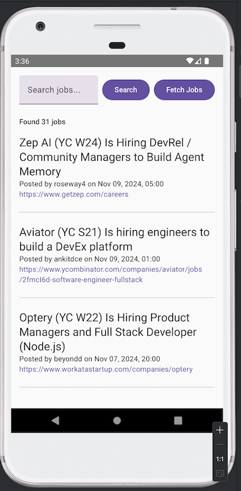

# Hacker News Jobs Android App

Hacker News Jobs Android App is an Android application that allows users to browse, search, and save job listings from the Hacker News job board. This app is built using Jetpack Compose for the UI, with local data storage managed by Room, and network data fetched via Retrofit.

- [Hacker News Jobs Android App](#hacker-news-jobs-android-app)
  - [Features](#features)
  - [Tech Stack](#tech-stack)
  - [Installation and Usage](#installation-and-usage)
    - [1. Clone the Project](#1-clone-the-project)
    - [2. Configuration](#2-configuration)
    - [3. Run the Project](#3-run-the-project)
  - [Main Files and Code Structure](#main-files-and-code-structure)
  - [Build Tools and Dependencies](#build-tools-and-dependencies)
  - [Usage](#usage)
    - [Explanation](#explanation)
  - [Illustration](#illustration)


## Features

- **Job Listings**: View a list of job posts from the Hacker News Job Board.
- **Real-time Search**: Search for jobs by title or webpage content keywords.
- **Data Fetching**: Fetch the latest job data from the Hacker News API and store it locally.
- **Webpage Preview**: Click on the job URL to open it directly in the browser.
- **Local Storage**: Store job data locally using Room for offline access.

## Tech Stack

- **Kotlin**: Main programming language for the app.
- **Jetpack Compose**: Used for building the user interface.
- **Room Database**: Used for local data persistence.
- **Retrofit**: Handles network requests to fetch job data.
- **Jsoup**: Used to retrieve webpage content from job URLs.
- **Coil**: Loads images in the job list view.

## Installation and Usage

### 1. Clone the Project
```bash
git clone https://github.com/yourusername/HackerNewsJobsAndroid.git
cd HackerNewsJobsAndroid
```

### 2. Configuration
Ensure all dependencies are correctly configured in the root `build.gradle` file.

### 3. Run the Project
- Open Android Studio.
- Import the project from the root directory.
- Connect an Android emulator or device, and click “Run” to start the application.

## Main Files and Code Structure

- `JobApp.kt`: Main UI code, including job search and data fetching functionality.
- `JobItem.kt`: Displays individual job listings with job details and clickable URLs.
- `JobViewModel.kt`: Manages data logic for the UI layer.
- `JobRepository.kt`: Implements data fetching, processing, and storing logic.
- `JobDao.kt` and `JobDatabase.kt`: Define and configure the Room database.

## Build Tools and Dependencies

- **Gradle**: Build tool.
- **Room**: Database library for local data persistence.
- **Retrofit**: For API calls.
- **Jsoup**: For HTML content parsing.
- **Compose Material3**: Jetpack Compose Material UI components.

## Usage

1. **Search Jobs**: Type job keywords into the search bar, press the search icon or hit enter to see matching jobs.
2. **Fetch Data**: Click the refresh button to fetch the latest jobs from Hacker News and store them locally.
3. **View Job Webpages**: Click on the job URL to open the corresponding webpage in the browser.

### Explanation

- **Features**: Lists the core features of the application.
- **Tech Stack**: Details the main technologies and libraries used.
- **Installation and Usage**: Provides steps for cloning, configuring, and running the project.
- **Main Files and Code Structure**: Describes the key files and their roles in the project.
- **Usage**: Guides users on how to perform key actions in the app, like searching and fetching data.
- **License**: Specifies the project's licensing terms.

Make sure to replace any placeholder links or project details with actual ones specific to your project.

## Illustration 
